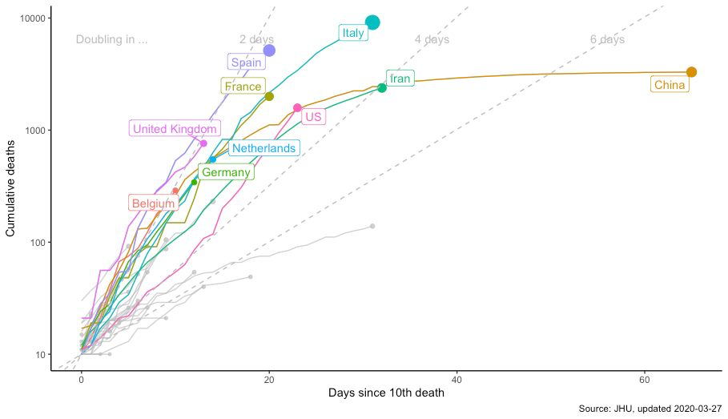

```{r setup, include=FALSE}
options(htmltools.dir.version = FALSE)
```

```{r xaringan-themer, include=FALSE, warning=FALSE}
library(xaringanthemer)
style_duo_accent(
  primary_color = "#096DF6",
  secondary_color = "#F69209",
  inverse_header_color = "#FFFFFF",
  header_font_google = google_font('Josefin Sans'),
  text_font_google   = google_font("Montserrat"),
  code_font_google   = google_font("Fira Mono"),
  base_font_size = "20px"
)
library(xaringanExtra)
use_tachyons()
```


## Who am I?

+ Early Data Community DC member and organizer
    + Co-founded Stat Programming DC with Marck Vaisman
+ Long term R user (since 1998), as first (data) language
+ Occassional blogger
--

+ Data science at a startup (Zansors)
    - stats, signal processing, business dev
+ Biostatistics/Machine Learning (AstraZeneca now, NIH for a decade)
+ Adjunct Faculty, Georgetown University and George Mason University
+ Promotes and teaches R & Python for data science and data visualization
    - Georgetown U, AstraZeneca, FAES @ NIH, District Data Labs

---

## The motivation for this talk

<ul style="margin-bottom:1.5cm;">
<li>Interest in global health, sustainable development goals (SDGs) and why some countries do better than others (using World Bank, WHO data)
<li>Using <i>Real World Evidence</i> (RWE) to help understand disease and potential therapeutic targets
<li>Hospital utilization across the US among Medicare recipients, for particular surgeries, and associations with American Community Survey data
</ul>

--

Discovering open data:

- Web scraping (**rvest**, **httr**, others)
- Availability of data sets (e.g., _data.gov_)
- Availability of API's (re: Marck Vaisman's talk at DCR 2019 ([video](https://youtu.be/Bi-QGGG5aN0), [slides](https://github.com/wahalulu/dcr2019-r-and-apis)))
- Availability of R packages

---

## The motivation for this talk

<ul style="margin-bottom:1.5cm;">
<li>Interest in global health, sustainable development goals (SDGs) and why some countries do better than others (using World Bank, WHO data)
<li>Using <i>Real World Evidence</i> (RWE) to help understand disease and potential therapeutic targets
<li>Hospital utilization across the US among Medicare recipients, for particular surgeries, and associations with American Community Survey data
</ul>

Discovering open data:

- Web scraping (**rvest**, **httr**, others)
- Availability of data sets (e.g., _data.gov_)
- Availability of API's (re: Marck Vaisman's talk at DCR 2019 ([video](https://youtu.be/Bi-QGGG5aN0), [slides](https://github.com/wahalulu/dcr2019-r-and-apis)))
- .heatinline[Availability of R packages ]

---

## The motivation for this talk

.fat[Then 2020 comes along!!]

--

.fl.w-50[
</img>
]
.fl.w-50[
.large[SARS-Covid2 Pandemic]

Visualizing incidence/prevalence/death

</img>
]

---
## The motivation for this talk

.fat[Then 2020 comes along!!]

.fl.w-50[
</img>
]
.fl.w-50[
Leveraging and aggregating open data:

+ [John Hopkins University CSSE](https://github.com/CSSEGISandData/COVID-19), Github available
+ [The COVID Tracking Project](covidtracking.com), API available
+ [New York Times](https://github.com/nytimes/covid-19-data), Github available
+ [Our World in Data](https://github.com/owid/covid-19-data/tree/master/public/data), Github available

.footnote[Caveat: Completeness and quality of data is uneven, to say the least]
]


---
class: inverse, middle, center

# Open data

---
background-image: url(img/opendata1.png)
background-size: 70%, 70%

.footnote[Source: data.gov]

---

## In the United States

### The federal government
The OPEN Government Data Act (2018) requires federal agencies to publish information online as open 
data, using standardized, machine-readable data formats

In addition to federal government data, data.gov includes data from 48 states, 48 cities and counties, 
and 218 international countries and regions

It currently provides access to over 218,000 data sets

### healthdata.gov

This portal provides data from federal government agencies with the US Department of Health and Human Services (DHHS) as well as partner cities and states

---
class: middle,center,inverse

# APIs

---

## APIs

There appears to be three APIs in common use for open government data, alongside several custom REST APIs

1. Socrata Open Data API (https://dev.socrata.com/)
1. CKAN (https://ckan.org)
1. DKAN (https://getdkan.org)
--


<p style='margin-top:2cm;'>As is common in government, there is no common API across all  the federal agencies</p>

- The CDC uses SODA
- data.gov uses CKAN, as does data.gov.uk. The European Union used to use this, but has switched to a custom REST API (data.europa.eu)
- healthdata.gov uses DKAN
- FDA uses it's own API at open.fda.gov

---

## APIs

More globally, 

1. The World Health Organization provides not one but two APIs to access data in its Global Health Observatory
    - One uses the OpenData API
    - One uses the Athena API
1. The World Bank provides its own API at api.worldbank.org

---

## APIs

Most of the APIs for open gov data provide the data in JSON format. 

The basic tools to download data from APIs in R reside in the **httr** package

You can then parse the downloaded data using tools like **jsonlite**, **xml** and others. 

Sometimes you'll get lucky and the API has an access point for CSV data. 

---
class: middle,center,inverse

# But....I'm lazy...<br>and, like Jared, I love<br> `r icon::fa_r_project()` 

---
class: middle,center,inverse

# R packages

---
class: middle, center

### The R ecosystem is fantastic for my laziness

### Smart, interested developers have provided R packages that utilize these various APIs

---

## The World Bank

The World Bank has awesome data not just on economics (as you'd expect) but also on national healthcare metrics like mortality, fertility, nutrition

There are two R packages for interacting with the World Bank data: **WDI** and **wbstats**

For example, getting data to emulate Rosling's Gapminder data

.pull-left[
```{r wb, echo=T, eval=F}
pacman::p_load('tidyverse','wbstats')

indicators <- c(
  life_exp = "SP.DYN.LE00.IN", 
  gdp_capita ="NY.GDP.PCAP.CD", 
  pop = "SP.POP.TOTL"
  )

dat <- wb_data(indicators, start_date=2010)
```

You can search for indicators using `wb_search` and list them using `wb_indicators`
]
.pull-right[
```{r, echo=FALSE, cache=T}
pacman::p_load('tidyverse','wbstats')

indicators <- c(
  life_exp = "SP.DYN.LE00.IN", 
  gdp_capita ="NY.GDP.PCAP.CD", 
  pop = "SP.POP.TOTL"
  )

dat <- wb_data(indicators, start_date=2010)
knitr::kable(head(dat %>% select(country, date, gdp_capita, life_exp ))) %>% 
  kableExtra::kable_styling()
```

]

---

## The World Health Organization

The `r icon::fa_r_project()` package **WHO** is available on Github (expersso/WHO)

You can find all the codes available, use R to search them for what you want, and then retrieve the data

.pull-left[
```{r,eval=F}
library(WHO)

# codes <- get_codes()
codes <- readRDS('WHOcodes.rds')

life_expectancy_code <- 
  codes %>% 
  filter(str_detect(display, 
                    'Life expectancy at birth')) %>% 
  pull(label)

dat <- get_data(life_expectancy_code)
```
]
.pull-right[
```{r, echo=FALSE}
dat <- readRDS('whodat.rds')
dat %>% arrange(year, country) %>% 
  filter(sex=='Both sexes') %>% 
  select(year, country, value) %>% 
  knitr::kable() %>% 
  kableExtra::kable_styling()
```

]

---

## The FDA

The FDA provides an API to access various endpoints for drugs, devices, and food. Several
endpoints refer to adverse events and recalls. 

The FDA API doesn't require an API key, but having a (free) one allows more queries.

.pull-left[
```{r}
library(openfda)

patient_ages <- fda_query('/drug/event.json') %>% 
  fda_count('patient.patientonsetage') %>% 
  fda_exec()

```

]
.pull-right[
```{r, echo=FALSE, fig.height=4, message=FALSE}
ggplot(patient_ages, aes(term, count))+
  geom_point()+
  hrbrthemes::theme_ipsum()
```

]

---

## Socrata

The **RSocrata** package wraps the SODA API `r emo::ji('grin')`.

We'll grab CDC data on COVID deaths in Maryland by week

.pull-left[
```{r}
library(RSocrata)

covid_deaths <- 
  read.socrata('https://data.cdc.gov/resource/r8kw-7aab.csv')
md_deaths <- covid_deaths %>% 
  filter(state=='Maryland') %>% 
  select(end_week, covid_deaths)

```

There are also R packages for CKAN (**ckanr**) and DKAN (**dkanr**)
]
.pull-right[
```{r,echo=F, fig.height=5}
md_deaths <- md_deaths %>% 
  mutate(end_week = as.Date(end_week))
ggplot(md_deaths, aes(end_week, covid_deaths))+
  geom_point()+
  labs(x = 'Date', y='Number of deaths')+
  hrbrthemes::theme_ipsum()
```

]

---

## Since it's 2020

### Covid data packages

- COVID19
- coronavirus
- tidycovid19
- ....

---

## Wrap-up

There are many many data sources for health data world-wide

Many of them are open data from governments, which are available freely (well, maybe need to get an API key)

`r icon::fa_r_project()` has the packages to access and analyze them

---
class: middle,center,inverse

# Thank you

